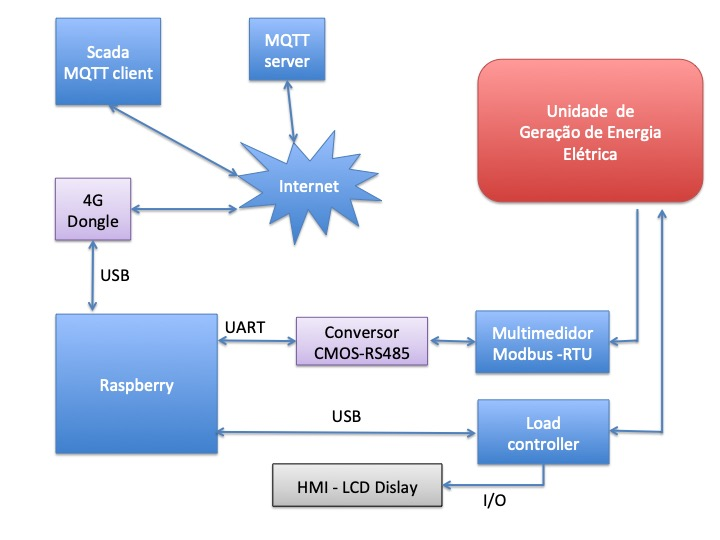
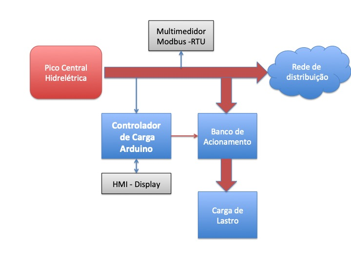
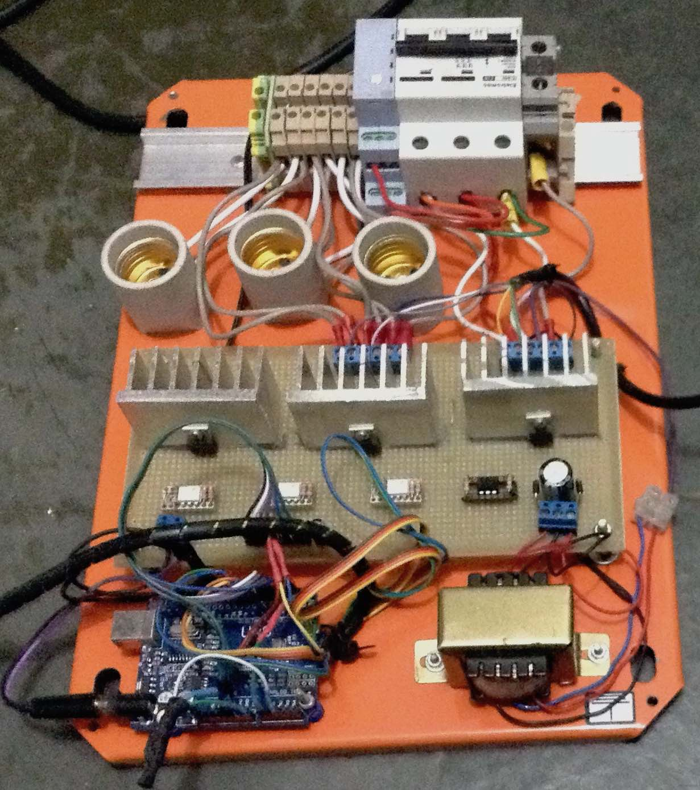
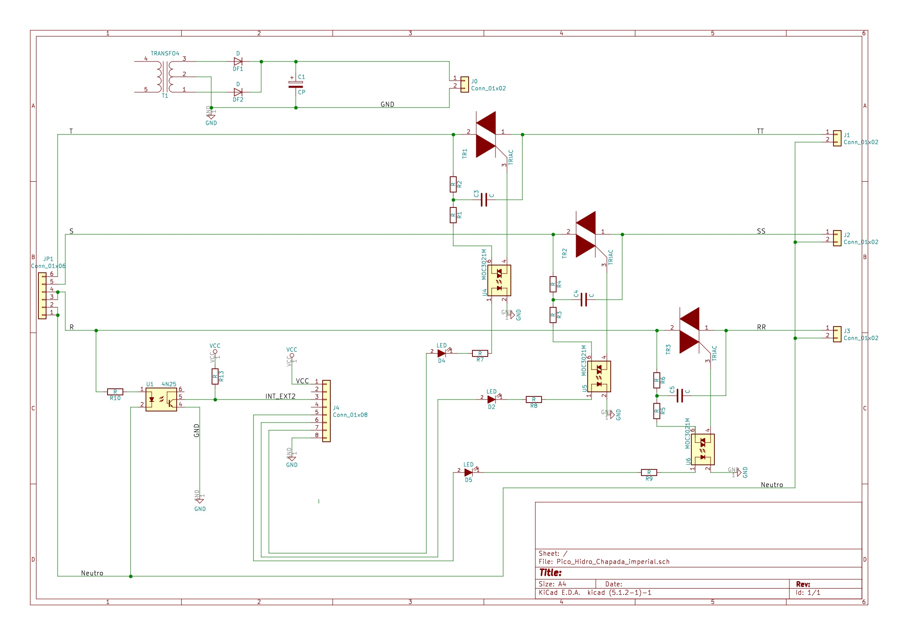

# Controlador de carga para pico central hidrelétrica
Rudivels@26/03/2020
`/Users/rudi/src/Central_remota_usina/Controlador_Carga_TriFasico`

Hardware e programa implementado com microcontrolador Arduino para controlar a carga de um pico central hidrelétrico trifasico por meio de triacs acionando uma carga de lastro resistiva.

*Arduino 3 plase Load controller with resistive dummy load*

# 1. Apresentação 
Este trabalho faz parte de um projeto de um central de monitoramento e comando de uma unidade geradora de energia elétrica numa localidade remota. 
A unidade geradora é um pico central hidrelétrica composto por uma turbina hidraulica e um gerador elétrica. 

O central tem que perimitir a configuração e/ou reprogramação remota de um controlador de carga dessa micro unidade geradora de energia elétrica que é implementado por meio de um microcontrolador Arduino. 

Além disso o central tem que monitorar a geração de energia elétrica e sua qualidade (potência, energia, fator de potência, interrupções de fornecimento, etc), e mandar essas informações via internet para um computador central onde será intergrada num sistema Supervisório Control and Data Aquisition (Scada). Este monitoramente está descrito no repositório em <https://github.com/rudivels/MicroHydro_Scada>

O diagrama de bloco de todo o sistema é mostrada no figura a seguir.

## 2. Controlador de Carga 

O objeto deste trabalho é o detalhamento do controlador de carga ou *load controller*. 

Há vários maneiras de controlar a energia de um pico ou micro central hidrelétrico. Dependendo do porte da instalação é vantajosa fazer o controle das características elétricas da central geradora atuando na entrada do central ou na sua saída. Geralmente em unidades com capacidade instalada acima de 100 kW a estratégia mais apropriada é variando a quantidade de água que entre no central hidrelétrica por meio de sistemas pneumáticos, hidraulicos ou eletromecânicos. Quando se trata de instalações menores, o investimento para implementar estes controles mecânicos se torna proibitivos e uma estratégia mais econômica é de controlar a saída do central hidrelétrica, deixando a entrada fixa. 

O principio de funcionamento neste caso baseado no principio de manter a carga aplicada no central hidrelétrica constante. Ou seja, a central gerador está configurada para trabalhar no seu ponto de máxima capacidade de geração de energia, enquanto se mantem a carga na saída do central sempre constante, compensando as reduções de demandas da rede de distribuição por meio do aumento de demanda na carga num lastro. 
O diagrama deste modelo é apresentado na figura a seguir.

A modulação da demanda na carga de lastro é implementado por meio de um banco de acionamento. Este banco de acionamento tem a função de drenar o excesso de energia na rede de distribuição. Em exemplo dessa implementação pode ser visto na bibliografia [1].

Este respositório detalhará a implementação do controlador de carga no Arduino, e também mostrará a estrutura de configuração e atualização remota do controlador pelo central de monitoração e comando. 

<!---
Comentario
Falar sobre rede trifásica
-->  

## 3. Implementação 

O hardware usado na implementação do controlador de carga tem os seguintes componentes:
- Arduino Uno
- Banco de triacs opto isolado para carga trifásica
- display LCD ST7920
- Raspberry

O principio de funcionamento do controlador é de manter sempre a carga aplicada a unidade geradora constante. Neste caso a unidade geradora é um pico central hidrelétrica com uma turbina Pelton que aciona um gerador trifasico sincrono de 1800 rpm @ 60hz de 3 KVA. 

Um foto do hardware montado com o Arduino é mostrada a seguir.

O esquemático da placa de acionamento com o banco de trais opto isolado é mostrada na figura a seguir.

1) Alimoestar SK. Design of a variable dump load switching control system for pico hydropower plants. (Master Renewable Energy Technology) Anton de Kom University of Suriname, 2020.  [link ](http://fga.unb.br/articles/0002/3737/Alimoestar_Thesis_8_maart_2020.pdf)